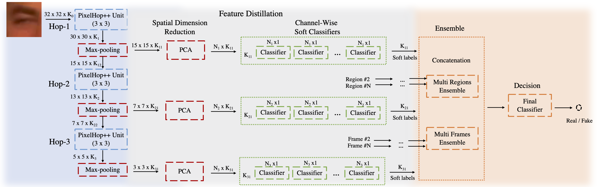

# DefakeHop: A Light-Weight High-Performance Deepfake Detector

This is the official Python implementation of our work: ["DefakeHop: A Light-Weight High-Performance Deepfake Detector"](https://arxiv.org/abs/2103.06929) accepted at ICME 2021.

State-of-the-art Deepfake detection methods are built upon deep neural networks. In this work, we proposed a non deep learning method to detect Deepfake videos which use the successive subspace learning (SSL) principle to extract features from various parts of face images. The features are also further distilled by our feature distillation module to derive a concise representation of the fake and real faces.



## Required packages
```bash
conda install -c anaconda pandas 
conda install -c conda-forge opencv
conda install -c anaconda scikit-image
conda install -c conda-forge matplotlib
conda install -c conda-forge scikit-learn
```

Since we use GPU to accelerate the processes, please install xgboost by pip
```
pip install xgboost 
```

## Data
Please put your videos in following folders accordingly
- train
    - real
    - fake
- test
    - real
    - fake

## Preprocessing
- Extracting the facial landmarks using [OpenFace](https://github.com/TadasBaltrusaitis/OpenFace).
Please check [here](https://github.com/TadasBaltrusaitis/OpenFace/wiki/Command-line-arguments) more more details.
```
python landmark_extractor.py
```
- Face alignment and Crop the facial regions
```
python patch_extractor.py
```
- Get the training and testing data
```
python data.py
```

## How to run
We use UADFV dataset as an example to show how to use our code to train and test the model.
```bash
python model.py
```

When we train the model, we use three items to train.
    
- Images: 4D numpy array (N,H,W,C).
- Labels: 1D numpy array where 1 is Fake and 0 is Real. 
- Names: 1D numpy array storing frame names. 

    The frame name should follow the format of **{video_name}_{frame_number}**. 

    Example: real/0047_0786.bmp, we can know it is the 786 th frame from real/0047.mp4
## Cite us
If you use this repository, please consider to cite.
```
@misc{chen2021defakehop,
      title={DefakeHop: A Light-Weight High-Performance Deepfake Detector}, 
      author={Hong-Shuo Chen and Mozhdeh Rouhsedaghat and Hamza Ghani and Shuowen Hu and Suya You and C. -C. Jay Kuo},
      year={2021},
      eprint={2103.06929},
      archivePrefix={arXiv},
      primaryClass={cs.CV}
}
```
## Acknowledgment
This work was supported by the Army Research Laboratory (ARL) under agreement W911NF2020157.
